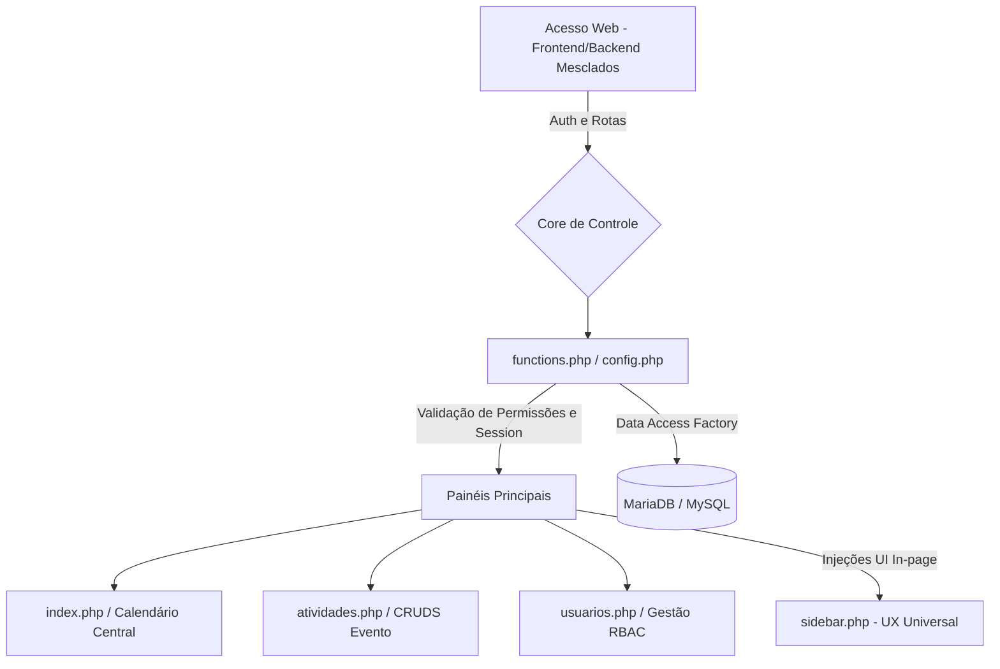

# 🏗️ Arquitetura e Engenharia de Software - PASCOM V2

Bem-vindo à engenharia profunda do PASCOM. Nossa prioridade arquitetural foca no **Performance First**, **Zero-Friction UX** e **Secure-by-Design** implementados num ecossistema 100% nativo Vanilla (sem abstrações obesas).

## 🧩 O Paradigma de Arquitetura

Nós utilizamos uma premissa **Procedural Estruturada Híbrida** injetada com Componentes e Padrões da orientação a objeto onde faz sentido (Data Access Objects).

### Camada 1: Database Access Wrapper (SOLID SRE)
Centralizada em `functions.php`:
O antigo padrão de acoplamento entre Views (`listar_usuarios.php`) e queries em texto aberto cruzando os arquivos foi aposentado. Nós estruturamos um **Wrapper** rigoroso de Injeção de Dependência (`db_query` e `db_execute`):
- **Prevenção Real:** Toda query repassada é obrigada a passar como Statement Preparado, travando SQL Injection de forma assintomática e global em todas as pontas da aplicação.
- **Uniformidade:** Menos `fetch_assoc` repetitivo, chamadas `fetch_all` nativas.

### Camada 2: Proteção Middleware (Anti-CSRF & Throttle)
Toda comunicação que gera mutação de estado (POST/DELETE) está blindada via **CSRF Guards** gerados server-side no `session` start. Validadores estritos barram chamadas não assinadas da Interface. 
Mutações que não vem acompanhadas de referenciadores diretos e limpos da Session do Usuário atual ou Paróquia não se movem na pipeline transacional.

### Camada 3: Motor UI/UX "Premium Glassmorphism" (Nielsen)
- **Heurística de Prevenção a Erros:** "Form Skeletons". Ao clicar em 'Salvar Evento', não disparamos requisições múltiplas ao banco; a interface intercepta globalmente o envio (no universal `sidebar.php`), congela os inputs e exibe Spinners Visuais assíncronos. Fim da fricção de "duplo clique no mouse".
- **Feedback Sensorial Dinâmico:** Os `alerts` travados criadores da década passada foram varridos do core da dashboard. Injeção dinâmica na URL ou Fetch API projeta `Toasts` em tempo real para os casos de validação de sucesso ou erro, estilo _iOS Native App_.
- **Estética:** Construído através de um sistema sólido de Variáveis Nativas CSS3 na `style.css` — garantindo temas vibrantes (com multi-color gradients e flashings) consumindo zero de Webpacks complexos de montar.

---

## 📂 Árvore de Diretórios e Fluxo

## 🔗 Dependências

A aplicação foi planejada sob o conceito de "**Zero-Vendors Abuses**":
- Servidor PHP 8.*
- MySQL Server ou MariaDB 10.* (Driver `mysqli`)
- Opcionais estritas de front-end, totalmente stand-alone (Não depende de Vue, React ou Node.js e nenhum daemon para operar, facilitando a portabilidade total para C-Panels em Hostings baratos de Igrejas).
